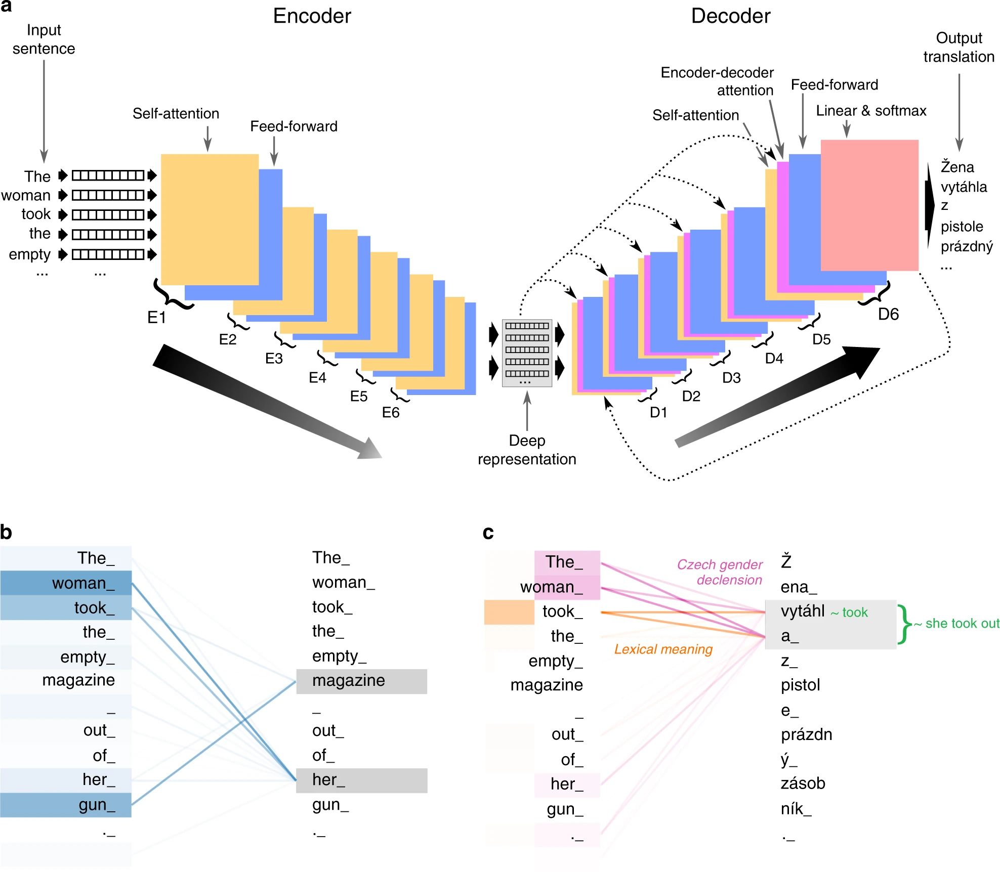
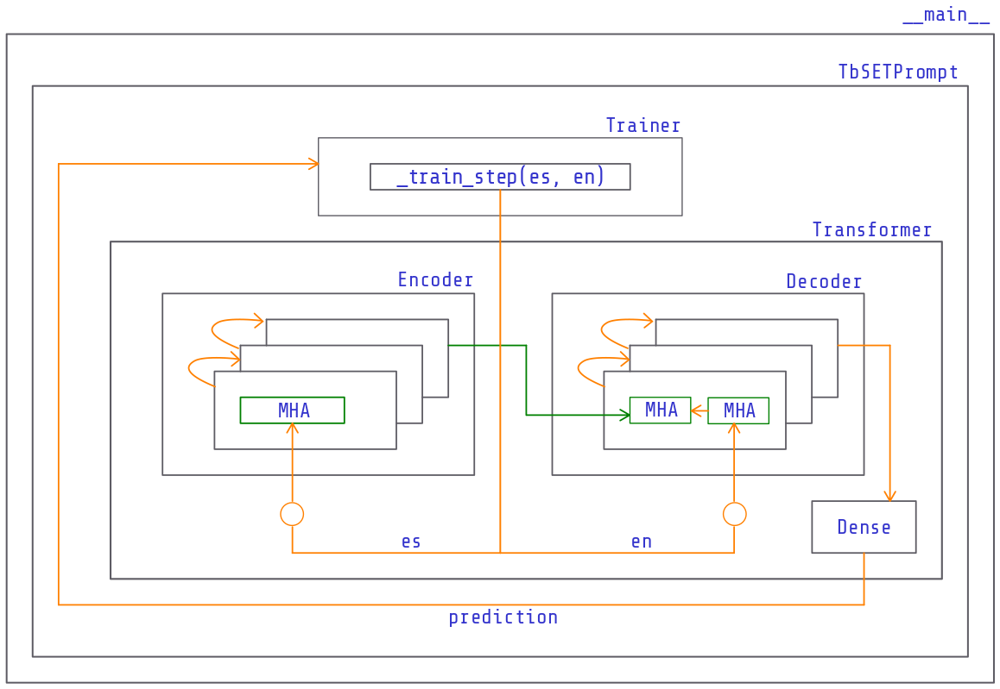

# What is this?
This repository contains a Spanish-English translator based on a Transformer model trained with 114k examples (customized training loop) in Google Cloud.

<p align='center'>
    
    <br>
    <span align='center' style="font-size: smaller;">A visualization of the Transformer architecture. Source: nature.com</span>
</p>

It is not a notebook but a modular object-oriented project with a simple TUI that allows interaction with the translator.

<p align="center">
<video controls width="100%" loop=true>
    <source src="tbset/assets/08-tbset-demo.webm.mp4" type="video/webm">
</video>
<br>
<span align='center' style="font-size: smaller;">The translator at inference time. Source: Own</span>
</p>

This project is a practical exercise to increase my knowledge and technical skills in NLP. For this reason, if you want to use it, keep in mind that it is not perfect, and that is not the purpose of its construction.

You can read the article related to this repository here. In the article, I detail the challenges I faced, delve into crucial concepts of the Transformer architecture, and share some practical advice for those in the same boat as me.

Enjoy!

## The project structure and pseudocode
It replicates the standard Transformer architecture as shown in image below:
<p align='center'>
    
    <br>
    <span align='center' style="font-size: smaller;">Source: Own</span>
</p>

From the image:
- The TUI loop invokes the training process through the `train` method. If it detects a saved model in the configuration file (`tbset.ini`) will load it for inference. Otherwise, it will read the configuration values and instantiate a `Trainer` object. The `trainer.train()` method is invoked to start training.
- The `Trainer` object instantiates a `Transformer` which creates the architecture with an Encoder, Decoder, and Dense layer. It also implements a custom training loop. The training process includes the following actions:
  - Dataset workout: A pipeline that downloads and prepares the dataset, creates batches, tokenize each batch (if vocabularies are missing, it will create them using a `BertTokenizer`), and prefetch the dataset.
  - Instantiate the Transformer model and set up the optimizer.
  - Restore any previous checkpoint if it is the case.
  - Run the custom loop to calculate the gradients with the predictions and update the model's parameters.
  - Save the trained model for later use.
- Each `call` to the Transformer object will:
  - Create the padding and look-ahead masks for the current source and target languages training batches.
  - Calculate the Encoder's output for the current source language training batch.
  - Calculate the Decoder's output from the current target language training batch and Encoder's output.
  - Return as a prediction the output of the Dense layer after the Decoder's output.
- The Encoder is composed of a stack of `EncoderLayer` objects. These layers perform the Multi-Headed Attention calculations for the current input and pass the results to the following layer.
- The Decoder is composed of a stack of `DecoderLayer` objects. These layers have three subblocks
  - The first one attends the current target language training batch or the output of the previous Decoder layer.
  - The second one attends the output of the first subblock plus the output of the Encoder's last layer.
  - The third one is an FFN that processes the output of the second subblock.

## The configuration file
All the hyperparameters and other variables values are managed from the `tbset.ini` configuration file. The current model was trained with the following values:
```
[TRN_HYPERP]
num_layers = 4
d_model = 128
num_heads = 8
dff = 512
dropout_rate = 0.1
ckpt_path = tbset/local.multivac/checkpoints
save_path = tbset/local.multivac/saved_model
epochs = 400

[DATASET_HYPERP]
dwn_destination = tbset/local.multivac/dataset
vocab_path = tbset/local.multivac/dataset
buffer_size = 2000
batch_size = 64
vocab_size = 8000
num_examples = 114000
```

These parameters make a smaller model comparing it with the base model from Vaswani et. al:

> We trained our models on one machine with 8 NVIDIA P100 GPUs. For our base models using the hyperparameters described throughout the paper, each training step took about 0.4 seconds. We trained the base models for a total of 100,000 steps or 12 hours. For our big models,(described on the bottom line of table 3), step time was 1.0 seconds. The big models were trained for 300,000 steps
(3.5 days).

## The dataset
I used the OPUS dataset available in the TF catalog. This dataset contains a collection of translated texts from the web. The OPUS corpora is a huge repository containing formal and informal text. My first idea was to merge two datasets, the Books and the Subtitles corpora. Sadly, the Books is not yet available in the TensorFlow catalog.

For this reason, I trained the model with the Subtitles dataset only, which produced acceptable results given the particularities of this type of text content.

## The hardware used for training
I trained the model in a VM from Google Cloud. The technical characteristics of this VM were:
- CPUs: 4
- Memory: 15 GB
- GPU: One Tesla T4

The training time was almost nine hours (400 epochs and 114K training examples) obtaining a loss of 1.1077 and an accuracy of 0.7303.

## The development process
It was challenging coding this project following a modular and object-oriented mindset. For this reason, and the quota limitations, I discarded Kaggle or Colab. On the other hand, I wanted to have a real business-like experience. For this reason, I launched a VM on GCP with a preloaded image with Tensorflow 2.6, added the additional dependencies, and connected my IDE to this remote interpreter deploying my code and training the model on the cloud.

# How can I use it?
This repository contains the model's parameters after training so it is very easy to use the translator for inference:
- Clone the repository
- Install the dependencies
- Run the module with `$ python -m tbset`
- There are two commands available. `train` will train the model from scratch. If a saved model is detected it won't be possible to continue unless you delete the related files from the disk, including the stored checkpoints. The `translate` command will use a saved model for inference.
- To exit the TUI press Ctrl-D

## Requirements
Dependency-wise, I have found it is tricky to use `tensorflow-text`. If you are starting from scratch, I'd recommend first install the desired version of `tensorflow-text`. TF text will install the appropriate version of `tensorflow` as it requires it to work. If you are using a preinstalled VM be sure the `tensorflow-text` version matches the version of `tensorflow`. 

As I instantiated a `tensorflow` 2.6.0. VM, these are the dependencies I added:
- tensorflow-text 2.6.0
- tensorflow-datasets 4.3.0
- prompt-toolkit 3.0.20

# Where can I learn more about NLP?
You can check <a href='https://github.com/ig-perez/nlp-roadmap' target='_blank' rel='noopener noreferrer'>this repository</a> or read some of <a href='https://ivanperez.pe/blog' target='_blank' rel='noopener noreferrer'>my blog posts</a>. Have fun! :)